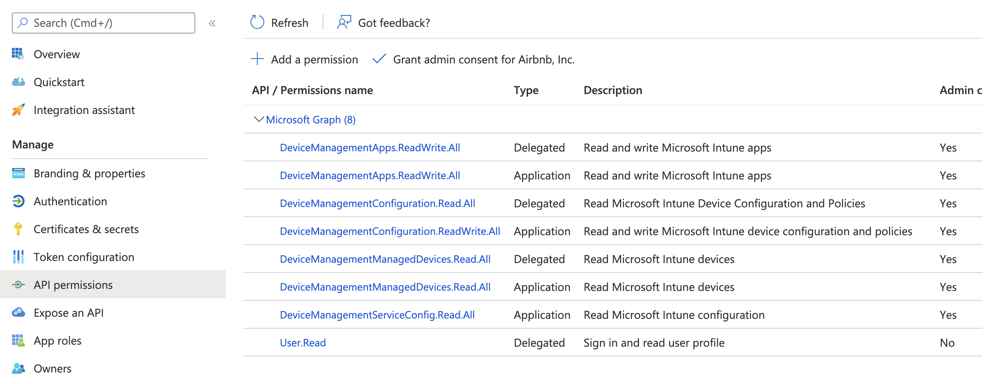

## Disclaimer

- This is NOT a functional autopkg processor yet. 
- This will not yet result in completely successful upload. See code comments for more details (some additional API calls are need to signal to Intune that the package is "ready for deployment")

## App Permissions

